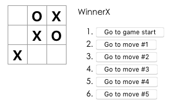

# XOX-Game With React
My first practical tutorial with React was build with this description:
https://reactjs.org/tutorial/tutorial.html

*a screenshot of my simple xox game version*

## Setup
Install node.js and npm. Execute the following instructions 
https://reactjs.org/docs/create-a-new-react-app.html#create-react-app

(i) The from npm generated sources are not included in this repo...